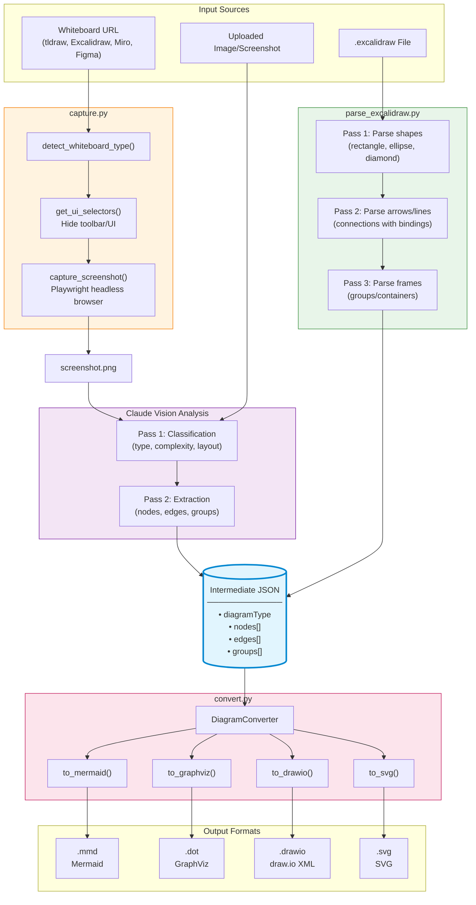

# Design Documentation

## Architecture Overview

The diagram-to-vector tool follows a **pipeline pattern** with two entry points converging at the Intermediate JSON Format. This is an ETL (Extract-Transform-Load) design where:

- `capture.py` and `parse_excalidraw.py` are **extractors**
- Claude Vision is the **transformer** (for screenshots)
- `convert.py` is the **loader/formatter**

### System Diagram



### Component Summary

| File | Role | Input | Output |
|------|------|-------|--------|
| **capture.py** | Screenshot capture | Whiteboard URL | PNG image |
| **parse_excalidraw.py** | Direct parser | `.excalidraw` JSON | Intermediate JSON |
| **convert.py** | Format generator | Intermediate JSON | Mermaid/GraphViz/draw.io/SVG |

### Two Pathways to Intermediate JSON

1. **Vision Path**: `URL → capture.py → PNG → Claude Vision → Intermediate JSON`
2. **Direct Path**: `.excalidraw file → parse_excalidraw.py → Intermediate JSON`

The Intermediate JSON acts as the **pivot point** — all inputs normalize to it, and all outputs derive from it. This decouples input handling from output generation, reducing complexity from O(N×M) to O(N+M).

---

## Intermediate JSON Format

The Intermediate JSON Format is a canonical representation that bridges visual diagram sources (screenshots, whiteboard URLs, Excalidraw files) and output vector formats (Mermaid, draw.io, GraphViz, SVG).

### Top-Level Structure

```json
{
  "diagramType": "flowchart|sequence|architecture|erd|mindmap",
  "title": "Diagram title",
  "source": "excalidraw",
  "sourceFile": "path/to/file",
  "overallConfidence": 0.92,
  "nodes": [...],
  "edges": [...],
  "groups": [...]
}
```

### Nodes

Nodes represent shapes/boxes in the diagram:

| Field | Required | Description |
|-------|----------|-------------|
| `id` | ✓ | Unique identifier (VCS-friendly, label-based) |
| `type` | ✓ | Shape: `rectangle`, `ellipse`, `diamond`, `cylinder`, `parallelogram` |
| `label` | ✓ | Display text |
| `x`, `y` | ✓ | Position coordinates |
| `width`, `height` | | Dimensions (defaults: 120×60) |
| `style` | | `{fillColor, strokeColor}` |
| `confidence` | | Vision recognition confidence (0-1) |

**Example:**
```json
{
  "id": "process_data",
  "type": "rectangle",
  "label": "Process Data",
  "x": 100, "y": 200,
  "width": 120, "height": 60,
  "style": { "fillColor": "#fff3cd", "strokeColor": "#856404" },
  "confidence": 0.95
}
```

### Edges

Edges represent connections/arrows:

| Field | Required | Description |
|-------|----------|-------------|
| `id` | ✓ | Unique identifier (`from_to_to` pattern) |
| `from`, `to` | ✓ | Source/target node IDs |
| `type` | | `arrow` (default), `line` |
| `label` | | Edge label text |
| `style` | | `{strokeStyle: "dashed"|"solid"}` |
| `confidence` | | Vision recognition confidence |

**Example:**
```json
{
  "id": "start_to_process",
  "from": "start",
  "to": "process_data",
  "type": "arrow",
  "label": "Begin",
  "style": { "strokeStyle": "dashed" },
  "confidence": 0.95
}
```

### Groups

Groups represent visual containers (subgraphs, frames):

| Field | Required | Description |
|-------|----------|-------------|
| `id` | ✓ | Group identifier |
| `label` | | Display name |
| `nodeIds` | ✓ | Array of contained node IDs |

**Example:**
```json
{
  "id": "dev_env",
  "label": "DEV",
  "nodeIds": ["artifact_dev", "deploy_dev"]
}
```

### Design Decisions

**VCS-friendly IDs**: IDs are derived from labels (e.g., `process_data` not `uuid-1234`), making git diffs readable. Collisions are handled with context (e.g., `artifact_dev`, `artifact_prod` for nodes with same label "Artifact").

**Position preservation**: The `x`, `y` coordinates enable position-aware formats (draw.io, SVG) to maintain spatial layout, while structure-oriented formats (Mermaid, GraphViz) can ignore them and use auto-layout.

**Confidence scores**: When Claude vision analyzes a screenshot, these scores indicate recognition certainty — useful for flagging ambiguous elements that may need human review.

---

## Script Details

### capture.py

Captures screenshots from whiteboard URLs using Playwright headless browser.

**Key Functions:**
- `detect_whiteboard_type(url)` - Auto-detects tldraw, Excalidraw, Miro, Figma, etc.
- `get_ui_selectors(type)` - Returns CSS selectors for UI elements to hide
- `capture_screenshot(...)` - Main capture logic with zoom, wait, region options

**Supported whiteboards:** tldraw, Excalidraw, Miro, Figma, Whimsical, Lucidchart

### parse_excalidraw.py

Parses Excalidraw JSON files directly into Intermediate JSON (bypasses vision analysis).

**Three-pass algorithm:**
1. **Pass 1**: Extract shapes (rectangle, ellipse, diamond) with bound text
2. **Pass 2**: Extract arrows/lines with start/end bindings
3. **Pass 3**: Extract frames as groups

**Key Functions:**
- `sanitize_id(text, existing)` - Creates VCS-friendly snake_case IDs with collision handling
- `find_bound_text(eid, elements)` - Finds text bound to a shape element
- `parse_excalidraw(path)` - Main parser returning Intermediate JSON

### convert.py

Converts Intermediate JSON to output formats using the `DiagramConverter` class.

**Layout modes:**
- `structure` (default for Mermaid/GraphViz) - Auto-layout, ignores positions
- `position` (default for draw.io/SVG) - Preserves spatial coordinates

**Output methods:**
- `to_mermaid()` - Flowchart syntax with subgraphs and styles
- `to_graphviz()` - DOT language with clusters
- `to_drawio()` - mxGraph XML format
- `to_svg()` - Direct SVG with positioned elements

See `example.json` for a complete Intermediate JSON example.
